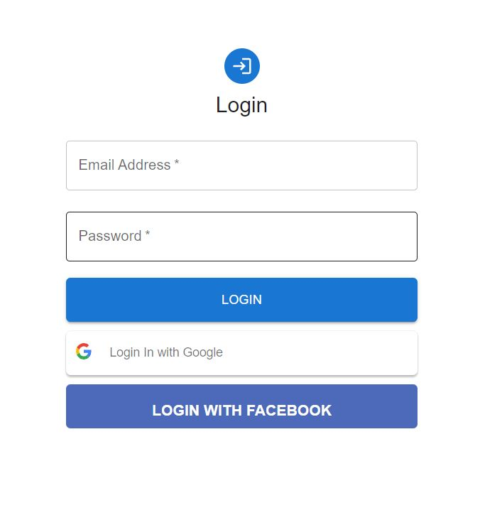
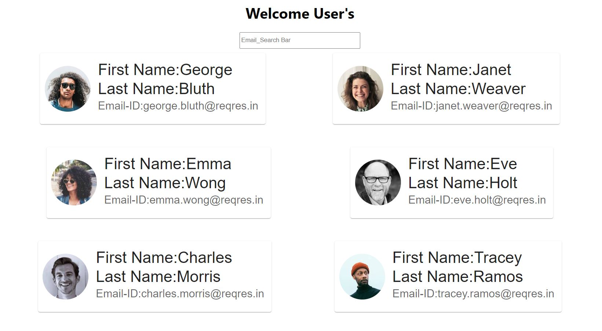

# Getting Started with Create React App

### npx create-react-app login_page

# Step second

remove unnecessary files
create a Components folder in src directory

#### create Three files 1. Login.js 2. Welcomepage.js 3. UserCard.js

## Install material ui package

### npm install @mui/material

### npm i @mui/icons-material

# Step Three

create simple login screen ui design

## create Google and Facebook login buttons

first install google and facebook login package

### npm i react-google-login

### npm i react-facebook-login

create Google and Facebook developer (ID's)

Then create some functions like 1. onLoginSuccess 2. onLoginFailure 3.handleSubmit

const onLoginSuccess = (event) => {
console.log("Login Success:", event.profileObj);
history.push("/welcomepage");
};

const onLoginFailure = (event) => {
console.log("Login Failed:", event);
};

const handleSubmit = (event) => {
event.preventDefault();
const data = new FormData(event.currentTarget);
console.log({
email: data.get("email"),
password: data.get("password"),
});
history.push("/welcomepage");
};

# Login Screen

#### Then fetch user's data using API

creat user cards

# Welcome Screen

## Final process filter out single users with their email using filter method
